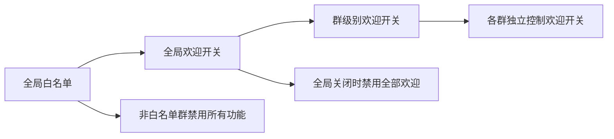

# 群控助手 - BotKeeper

一个用于管理 QQ 群聊的 AstrBot 插件，专为 HTS Team 设计。

---

## ✨ 功能特性

| 功能分类 | 功能描述 |
|----------|----------|
| 🎉 新人欢迎 | 自动欢迎新成员加入群聊，支持 `{membername}` 变量表示新人昵称 |
| 🔇 禁言管理 | 支持单个禁言、全员禁言与解禁 |
| 🔄 撤回消息 | 撤回指定用户最近发送的消息 |
| 🏷️ 群名片管理 | 修改群昵称、设置专属头衔 |
| 📌 精华消息 | 设置与移除群精华消息 |
| 🔧 权限控制 | 自动同步群内管理员角色，群主和管理员可操作 |
| 🛡️ 命令拦截 | 接管所有 `/bot` 开头的命令，无效命令自动提示，非白名单群静默处理 |
| 📋 群白名单 | 支持配置白名单群号，仅白名单内的群可使用插件功能 |
| 🛰️ 巡检监控 | 自动检测群消息，支持 WebUI 配置关键词/正则/消息类型规则，违规自动处理（撤回/禁言/回复/踢出） |

---

## 📦 安装方式

### 方式一：插件市场安装（暂未发布）
在 AstrBot WebUI 的插件市场中搜索 **BotKeeper** 或 **群控助手**，点击安装即可。

### 方式二：手动安装

输入仓库链接：

`https://github.com/SSJ-ZYJ/astrbot_plugin_group_keeper/`

进行安装。

---

## 📖 使用说明

### 指令前缀

所有指令统一使用 `/bot` 作为前缀。每个指令都支持中英文别名。

支持以下两种输入格式：
- 直接输入：`/bot help`
- @机器人：`@机器人 /bot help`

### 指令列表

| 指令 | 中文别名 | 功能描述 | 权限要求 |
|------|----------|----------|----------|
| `/bot help` | `/bot 帮助` | 显示帮助信息 | 所有人 |
| `/bot welcome [on\|off\|message <文本>]` | `/bot 欢迎 [on\|off\|message <文本>]` | 新人欢迎设置 | 管理员和群主 |
| `/bot mute <QQ> [秒数]` | `/bot 禁言 <QQ> [秒数]` | 禁言指定用户 | 管理员和群主 |
| `/bot unmute <QQ>` | `/bot 解禁 <QQ>` | 解除禁言 | 管理员和群主 |
| `/bot global_mute on\|off` | `/bot 全员禁言 on\|off` | 全员禁言控制 | 管理员和群主 |
| `/bot recall <QQ> [数量]` | `/bot 撤回 <QQ> [数量]` | 撤回指定用户消息 | 管理员和群主 |
| `/bot rename <QQ> <昵称>` | `/bot 改名 <QQ> <昵称>` | 修改群昵称 | 管理员和群主 |
| `/bot title <QQ> <头衔>` | `/bot 头衔 <QQ> <头衔>` | 设置专属头衔 | 管理员和群主 |
| `/bot promote <QQ>` | `/bot 提升 <QQ>` | 提升为管理员 | 管理员和群主 |
| `/bot demote <QQ>` | `/bot 降级 <QQ>` | 移除管理员 | 管理员和群主 | 
| `/bot set_group_name <名称>` | `/bot 设置群名 <名称>` | 修改群名称 | 管理员和群主 |
| `/bot set_essence` | `/bot 设精` | 设置引用的消息为群精华 | 所有人 |
| `/bot remove_essence` | `/bot 移精` | 移除引用的群精华消息 | 所有人 |

> [!TIP] 
> `<QQ>` 可以为 @群成员 或 QQ号。
> 如：`/bot title @SSJ 神秘头衔` 或 `/bot title 176*****76 神秘头衔` 。

### 使用示例

```bash
# 开启新人欢迎
/bot welcome on

# 禁言用户 5 分钟
/bot mute @SSJ 300

# 设置专属头衔
/bot title @SSJ 神秘头衔

# 修改群名（支持带空格的名称）
/bot set_group_name "HTS Team | 2026"

# 设置群精华消息（先引用/回复需要操作的消息，再发送指令）
/bot set_essence

# 移除群精华消息（先引用/回复需要操作的消息，再发送指令）
/bot remove_essence
```

### 欢迎消息变量

欢迎消息支持以下变量，发送时会自动替换为实际值：

| 变量 | 说明 | 示例 |
|------|------|------|
| `{membername}` | 新成员的QQ昵称 | 欢迎 xxx 加入群聊！ |

示例：设置自定义欢迎消息
```
/bot welcome message "欢迎 {membername} 加入群聊！"
```

### 命令拦截机制

插件会接管所有以 `/bot` 开头的命令（包括 `@机器人 /bot xxx` 格式），处理逻辑如下：

| 场景 | 处理方式 |
|------|----------|
| 白名单群 + 有效命令 | 正常执行并回复 |
| 白名单群 + 无效命令 | 提示"指令不存在" |
| 非白名单群 + 任意命令 | 静默处理，不回复 |
| 非 `/bot` 开头的消息 | 不处理，交给其他插件（如 LLM） |

> [!CAUTION] 
> 启用白名单后，非白名单群聊中以 `/bot` 开头的一切消息将被静默忽略，不会产生任何回复。

---

## ⚙️ 配置说明

插件配置通过 AstrBot WebUI 管理，包含以下选项：

### 全局配置

| 配置项 | 类型 | 默认值 | 说明 |
|--------|------|--------|------|
| `locale` | 选择 | zh_CN | 插件显示语言（简体中文 / English） |
| `whitelist_enabled` | 布尔 | false | 启用群白名单，启用后只有白名单内的群可使用插件 |
| `group_whitelist` | 列表 | [] | 群白名单列表，输入群号，多个群号用换行分隔 |
| `welcome_global_enabled` | 布尔 | true | 新人欢迎全局总开关，关闭后所有群的欢迎功能都将禁用 |
| `welcome_default_enabled` | 布尔 | true | 新群首次触发时是否默认开启欢迎消息 |
| `default_mute_duration` | 整数 | 30 | 默认禁言时长（秒） |
| `default_welcome_message` | 文本 | (空) | 默认欢迎消息，留空使用默认欢迎消息。支持 `{membername}` 变量 |
| `max_recall_count` | 整数 | 10 | 单次最多撤回消息条数 |
| `enable_long_message_merge` | 布尔 | true | 启用后，超过阈值的回复将以单节点合并消息形式完整发送 |
| `long_message_threshold` | 整数 | 350 | 长消息合并阈值（字符），超过后不拆分内容 |

> [!NOTE]
> 默认欢迎消息为："🎉欢迎 {membername} 加入群聊！✨"

### 群级别配置

每个群支持独立配置，通过指令或配置文件管理：

| 配置项 | 说明 | 控制指令 |
|--------|------|----------|
| `welcome_enabled` | 当前群是否开启欢迎 | `/bot welcome on/off` |
| `welcome_message` | 当前群的自定义欢迎消息 | `/bot welcome message <文本>` |

群配置文件存储在 AstrBot 数据目录的 `plugin_data/astrbot_plugin_group_keeper/groups/group_<群号>.json`。

### 配置优先级



> [!CAUTION] 
> `welcome_global_enabled` 是总开关，关闭后所有群的欢迎功能都会禁用，无论群级别配置如何。

### 巡检模块配置

巡检模块配置通过 WebUI 管理，采用三级分组结构：

#### 巡检模块设置

| 配置项 | 类型 | 默认值 | 说明 |
|--------|------|--------|------|
| `sentinel_enabled` | 布尔 | false | 巡检监控全局总开关 |
| `sentinel_group_blacklist` | 列表 | [] | 群黑名单，这些群的消息不检测 |
| `sentinel_user_whitelist` | 列表 | [] | 用户白名单，这些用户的消息不检测 |

#### 检测规则配置

支持两种规则模板，可在 WebUI 动态添加：

| 规则模板 | 说明 |
|----------|------|
| `keyword_rule` | 关键词/正则匹配检测，支持自定义回复、禁言、踢出等动作 |
| `type_rule` | 消息类型检测（图片/语音/视频等），支持自定义回复、禁言、踢出等动作 |

### 变量模板

巡检模块支持以下变量模板，可用于回复消息和踢出提示：

| 变量 | 说明 |
|------|------|
| `{id}` | 触发用户的 QQ 号 |
| `{name}` | 触发用户的昵称 |
| `{date}` | 当前日期（YYYY-MM-DD） |
| `{time}` | 当前时间（HH:MM:SS） |

---

## 🌍 国际化支持

插件目前支持中文和英文两种语言：

- **机器人消息语言**：通过配置文件中的 `locale` 选项切换（`zh_CN` / `en_US`），控制机器人在群聊中的回复语言。
- **WebUI 配置页语言**：通过 AstrBot WebUI 右上角的语言切换器切换，自动显示对应语言的配置描述。
- **插件外显名称**：根据语言设置自动切换显示名称
  - 中文：`群控助手 - BotKeeper`
  - 英文：`BotKeeper - Group Manager`

---

## 🛡️ 权限说明

| 权限等级 | 说明 | 可执行操作 |
|----------|------|------------|
| 成员 | 普通群成员 | 查看帮助 |
| 管理员 | 群内真实管理员 | 禁言、解禁、撤回、改名、设置头衔、提升/降级管理员 |
| 群主 | 群创建者 | 所有管理员操作 |

> [!TIP] 
> 权限自动同步群内真实的管理员角色，无需手动添加。

---

## 📱 支持平台

- QQ (aiocqhttp)

---

## 📌 版本要求

- AstrBot >= v4.10.4

---

## 📄 许可证

GNU Affero General Public License v3

---

## 🤝 贡献

欢迎提交 Issue 和 Pull Request！

---

## 📋 更新日志

详见 [CHANGELOG.md](./CHANGELOG.md)

---

*Made with ❤️ for HTS Team*
